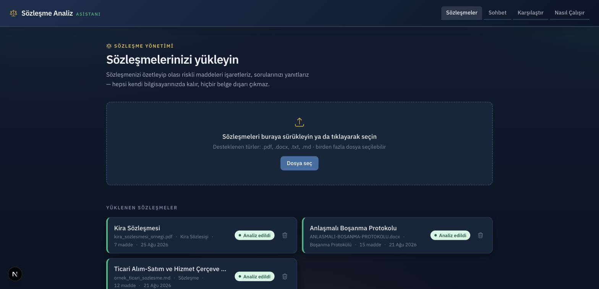
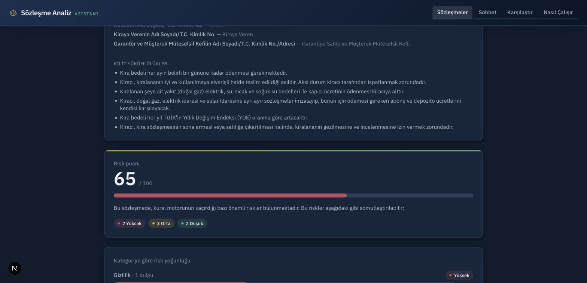
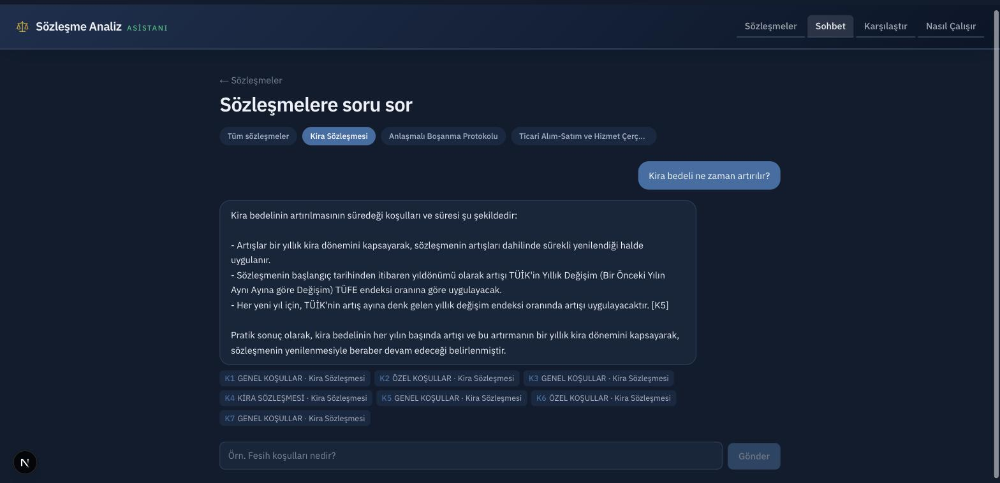
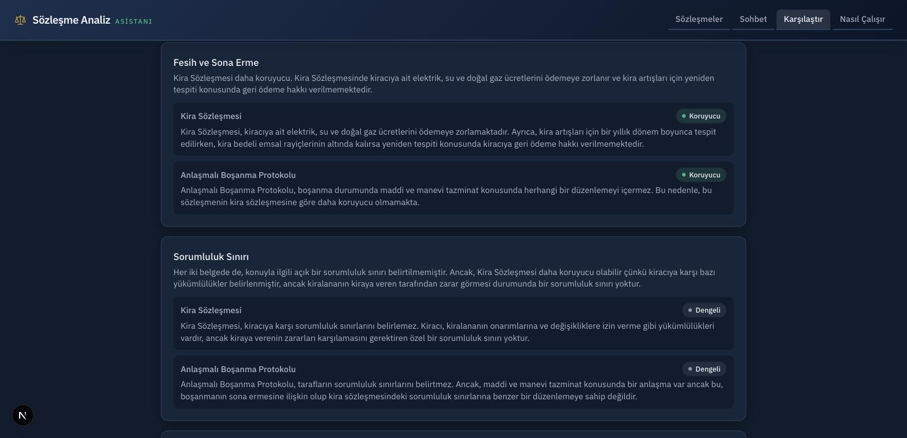

# Sözleşme Analiz Asistanı

**RAG (Retrieval-Augmented Generation) tabanlı**, tamamen yerel çalışan bir
sözleşme inceleme asistanı. Sözleşmelerinizi yükleyin; içeriğini özetleyelim,
dikkat etmeniz gereken maddeleri işaretleyelim, aklınıza takılan soruları
kaynak göstererek yanıtlayalım ve isterseniz birden fazla sözleşmeyi
karşılaştıralım.

Hiçbir belge internete ya da üçüncü bir servise gönderilmez, her şey kendi
bilgisayarınızda kalır.

> **Not:** Bu araç sözleşme inceleme sürecini desteklemek için geliştirilmiştir.
> Ürettiği analiz ve yanıtlar profesyonel hukuki danışmanlığın yerini tutmaz.

## Ekran görüntüleri

| | |
|---|---|
| **Sözleşme yükleme ve liste** | **Risk analizi** |
|  |  |
| **Kaynaklı sohbet** | **Karşılaştırma** |
|  |  |

## Özellikler

- **Sözleşme yükleme** — PDF, DOCX, TXT ve Markdown (.md) dosyaları desteklenir,
  birden fazla dosya aynı anda yüklenebilir.
- **Otomatik özet** — taraflar, tutar, tarihler ve önemli yükümlülükler
  otomatik çıkarılır.
- **Risk analizi** — sık karşılaşılan riskli ifadeler ve eksik olabilecek
  standart maddeler taranır; bulgular önem derecesine göre (kritik / yüksek /
  orta / düşük) işaretlenir. Kontrol listesi sözleşmenin türüne göre uyarlanır
  (örn. bir boşanma protokolünde ticari sözleşmelere özgü konular aranmaz).
- **Kaynaklı sohbet (RAG)** — sözleşmeyle ilgili sorularınız önce ilgili
  maddeleri bulan bir arama katmanından geçer, yanıt yalnızca bu maddelere
  dayanarak üretilir ve hangi maddeye dayandığı gösterilir.
- **Karşılaştırma** — 2-5 sözleşmeyi seçip ortak konularda (fesih, sorumluluk,
  ödeme vb.) yan yana karşılaştırabilirsiniz; bu da aynı RAG katmanını kullanır.
  Deterministik risk matrisi anında, konu bazlı model yorumu ise her konu
  tamamlandıkça tek tek akar (SSE) — tam karşılaştırma bitene kadar beklemek
  yerine ilk sonuçlar saniyeler içinde görünür.
- **Nasıl Çalışır sayfası** — uygulama içi kullanım kılavuzu ve SSS.

## RAG mimarisi

Sohbet ve karşılaştırma özellikleri klasik bir **retrieve-then-generate**
akışı izler: önce sözleşme maddeleri arasından soruyla en alakalı olanlar
bulunur, sonra bu maddeler dil modeline bağlam olarak verilir ve yanıt
yalnızca bu maddelere dayanarak üretilip kaynak gösterilir (`app/rag/`,
`app/services/qa.py`, `app/services/compare.py`).

Geri getirme (retrieval) katmanı üç bağımsız sinyali birleştiren bir hibrit
arama motorudur (**Reciprocal Rank Fusion**, `app/rag/retriever.py`):

1. **BM25** — Türkçe kök yaklaşımıyla sözcüksel/anahtar kelime eşleşmesi.
2. **Karakter n-gram TF-IDF** — Türkçe çekim/ek varyantlarına dayanıklı
   (örn. "fesihte" ↔ "feshin").
3. **Dense (anlamsal) vektör arama** — opsiyonel, `sentence-transformers`
   çok dilli embedding modeliyle; hiçbir anahtar kelime paylaşmayan ama
   anlamca yakın sorularda da doğru maddeyi bulur.

Risk analizi ise farklı bir katmandır ve retrieval kullanmaz: deterministik
bir kural motoru (regex tabanlı) sözleşmenin tüm maddelerini tarar, bir dil
modeli bunun üzerine bağlamsal yorum ekler (`app/services/risk.py`).

## Teknoloji

| Katman | Teknoloji |
|---|---|
| Frontend | Next.js (App Router), TypeScript, Tailwind CSS |
| Backend | FastAPI (Python), SQLite |
| Dil modeli | [Ollama](https://ollama.com) — tamamen yerel, ücretsiz, API anahtarı gerekmez |
| RAG / arama | BM25 + karakter n-gram TF-IDF + dense embedding (`sentence-transformers`), RRF ile birleştirme |

## Kurulum

### Ön koşullar

- Python 3.11+
- Node.js 20+
- [Ollama](https://ollama.com) kurulu ve çalışır durumda

```bash
ollama pull qwen2.5:7b
```

### Backend

```bash
cd backend
python3 -m venv .venv
source .venv/bin/activate
pip install -r requirements.txt
cp .env.example .env
uvicorn app.main:app --port 8090 --reload
```

Anlamsal (dense) aramayı etkinleştirmek isterseniz (opsiyonel, ~2 GB indirir):

```bash
pip install -r requirements-embeddings.txt
```

### Frontend

```bash
cd frontend
npm install
cp .env.example .env.local
npm run dev -- --port 3000
```

Uygulama `http://localhost:3000` adresinde açılır.

## Proje yapısı

```
backend/
  app/
    ingest/      # Dosya ayrıştırma ve maddelere bölme
    llm/         # Ollama istemcisi ve promptlar
    rag/         # RAG geri getirme (retrieval) motoru — BM25 + n-gram + dense
    routers/     # API uç noktaları
    services/    # Risk analizi, soru-cevap, karşılaştırma mantığı
frontend/
  app/           # Sayfalar (sözleşmeler, sohbet, karşılaştır, nasıl çalışır)
  components/    # Paylaşılan arayüz bileşenleri
  lib/           # API istemcisi ve yardımcı fonksiyonlar
```

## Gizlilik

Yüklenen belgeler, çıkarılan analizler ve sohbet geçmişi yalnızca yerel
`backend/data/` klasöründeki SQLite veritabanında saklanır; bu klasör
depoya (repository) dahil değildir ve hiçbir veri dışarı gönderilmez.
